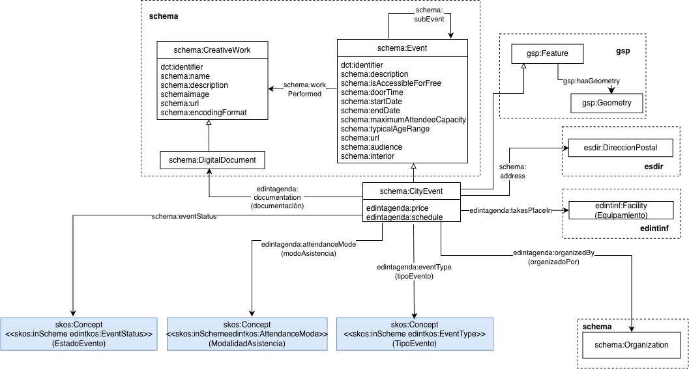

# Ontología de Agenda (Agenda ontology)

La ontología de Agenda representa los eventos culturales, deportivos y sociales que se llevan a cabo en una ciudad.

# Propósito y alcance de la ontología (Purpose and scope of the ontology)

El propósito de esta ontología es el de proporcionar un vocabulario común para la representación de datos principales de los eventos culturales, deportivos y sociales de un municipio. Su alcance incluye todo tipo de eventos representados mediante una taxonomía, el lugar donde se llevan a cabo, es decir, un elemento de la infraestructura municipal tal como por ejemplo, un centro cultural. Su alcance cubre los datos que pueden ser utilizados con los propósitos de conocer y gestionar los eventps que se llevan a cabo en el municipio que es parte de las funciones habituales de las entidades locales.

# Prefijo y espacio de nombres de la ontología (Prefix and namespace of the ontology)

El prefijo de la ontología es edintagenda y se encuentra publicada en el espacio de nombres [http://vocab.linkeddata.es/datosabiertos/def/cultura-ocio/agenda#](http://vocab.linkeddata.es/datosabiertos/def/cultura-ocio/agenda#) 

# Modelo conceptual de la ontología (Ontology conceptual model)

# Estructura del repositorio (Repository and structure)

El repositorio debe contener (al menos) las siguientes carpetas

| Carpeta | Descripción |
|--------|--------------|
| **diagrams/** | Contiene diagramas y otros recursos que representan el modelo conceptual de la ontología (por ejemplo, jerarquías de clases, relaciones). |
| **documentation/** | Contiene la documentación de la ontología y artefactos relacionados en formato HTML o dirigida a usuarios. |
| **tests/** | Contiene las pruebas para la evaluación de la ontología. |
| **kos/** | Contiene la implementación de vocabularios controlados o KOS, generalmente implementaciones SKOS en RDF.|
| **ontology/** | Contiene los archivos de implementación de la ontología en formatos como .owl, .rdf, .ttl o .jsonld |
| **requirements/** | Contiene todos los documentos utilizados para definir los requisitos de la ontología: ejemplos de datos, preguntas de competencia, requisitos funcionales, casos de uso, etc. |
| **shapes/** | Contiene las restricciones SHACL utilizad para validar datos respecto a la ontología.  |

# Mantenimiento del proyecto (Project maintenance) 

Para gestionar esos incidentes o las mejoras sugeridas con respecto a la ontología, recomendamos seguir las guías proporcionadas en [Issues Management](https://github.com/nombre-repositorio/wiki/issues-management) para generar incidecias (trabajo en progreso).

# Financiación (Funding)

Incluir aquí la información sobre financiación del proyecto e imágenes necesarias.
